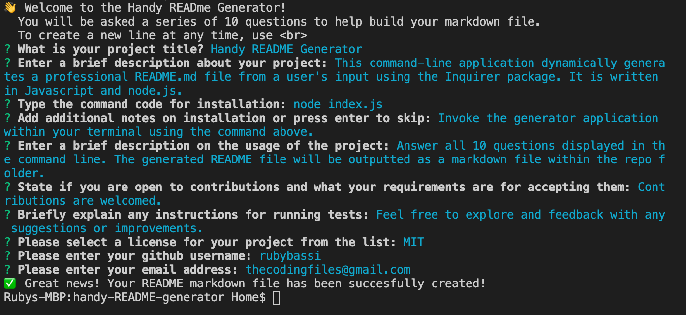

 

# Handy README Generator

## Description
This command-line application dynamically generates a professional README.md file from a user's input using the Inquirer package. It is written in Javascript and node.js.

> Watch a full demo video on my [YouTube channel](https://youtu.be/M6oav3l6Iko)

## Preview of the command line prompts



## Table of Contents
- [Installation](#Installation)
- [Usage](#Usage)
- [Contributing](#Contributing)
- [Test](#Test)
- [License](#License)
- [My Development Environment](#My-Development-Environment)
- [Questions](#Questions)

## Installation
```node index.js```

Invoke the generator application in your command line using the command above.

## Usage
Answer all 10 questions displayed in the command line. The generated README file will be outputted as a markdown file within the repo folder.

## Contributing
Contributions are welcomed.

## Test
Feel free to explore and feedback with any suggestions or improvements.

## License
MIT

## My Development Environment
* [Visual Studio Code](https://code.visualstudio.com/)
* Mac Terminal
* [Git](https://git-scm.com/book/en/v2/Getting-Started-Installing-Git)
* [Node.js](https://nodejs.org/en/)
* [NPM](https://www.npmjs.com/)
* [Inquirer](https://www.npmjs.com/package/inquirer)
* [Node Emoji](https://www.npmjs.com/package/node-emoji)

## Questions
Follow me on [GitHub: rubybassi](https://github.com/rubybassi)

If you have any additional questions, simply email me at <thecodingfiles@gmail.com> and i'll respond as soon as possible.
